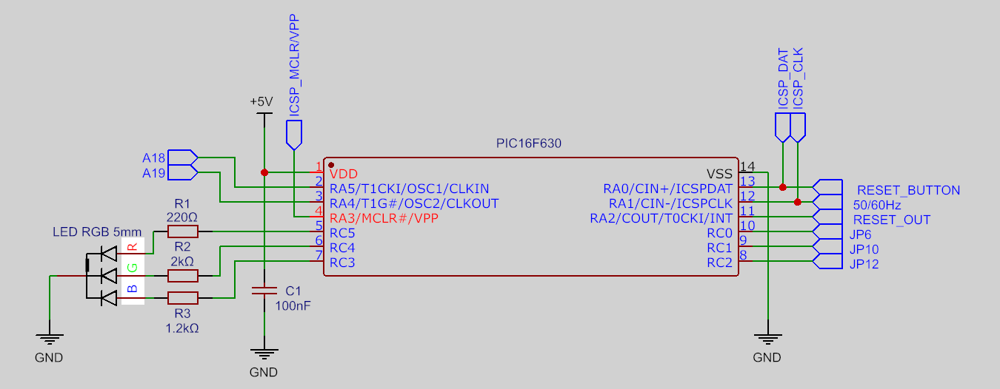
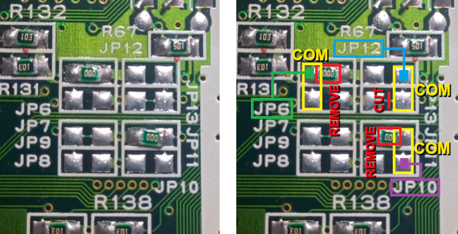
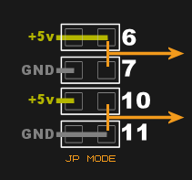
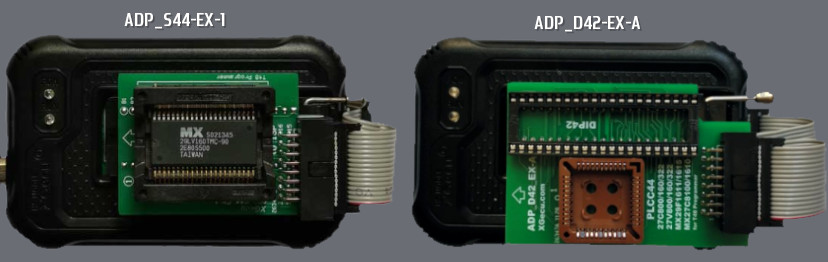
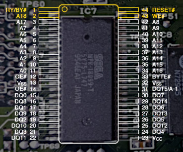
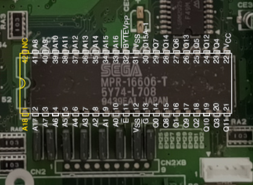
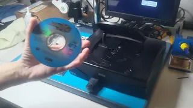

# Saturn Smart Reset Button

[](LICENSE)
[](../../releases)
[](../../releases)
[](https://youtu.be/afSKgW2aVuQ) 

SAT-SRB is a switchless mod for the Sega Saturn, expanding region selection with multi-BIOS bankswitching and RGB LED feedback. Originally based on the  [**Saturn Switchless Mod**](https://github.com/sebknzl/saturnmod) (2004), this version introduces full BIOS bankswitching support for reprogrammable ICs and enhances visual feedback with an RGB LED, while being entirely rewritten for the XC8 compiler. 

## Table of Contents
- [Building & Flashing](#building--flashing)
- [Installation Notes](#installation-notes)
- [BIOS Bankswitch Mapping](#bios-bankswitch-mapping)
- [Preparing BIOS Images](#preparing-bios-images-byte-swapping-and-merging)
- [Flashing BIOS](#flashing-bios-to-ic-programmers-and-adapters)
- [BIOS Installation](#physical-installation)
- [Demonstration Video](#demonstration-video)

---

## Features

- ✅ Switchless region selector (Japan/North America/Europe)
- ✅ Reset button control (short/medium/long press)
- ✅ Supports dual/multi-BIOS replacement using reprogrammable memory
- ✅ Manage up to 4 BIOS banks (address-selected by the PIC)
- ✅ RGB LED feedback (Common Cathode)
- ✅ LED colors and BIOS type fully configurable via `#define` macros
- ✅ 50Hz / 60Hz vertical frequency toggle
- ✅ EEPROM save for last selected region/frequency
- ✅ Works on all Sega Saturn boards

## RGB LED Support

> 🔴🟢🔵 LED colors for each region and BIOS banks can be customized:

```c
// ** LED COLOR ASSIGNMENT **
#define COLOR_JAP   LED_BLUE
#define COLOR_USA   LED_GREEN
#define COLOR_JAP2  LED_CYAN
#define COLOR_EUR   LED_ORANGE
#define COLOR_JAP3  LED_VIOLET
```

## Bankswitching Support for Dual/Multi-BIOS Upgrade  

This mod supports the following reprogrammable ICs for multi-bank BIOS replacement:

- 29F800 (SOP44, 8Mbit, 2 banks)
- 29F1610 (SOP44, 16Mbit, 4 banks)
- 27C800 (DIP42, 8Mbit, 2 banks)
- 27C160 (DIP42, 16Mbit, 4 banks)

> ℹ️ The BIOS chip size is predefined in code and can be changed if needed:
```c
// ** SELECT BIOS IC **
#define BIOS    IC_8M   // IC_16M (4 banks) | IC_8M (2 banks)
```
> ℹ️ Bankswitching is an optional feature.  
> If you're using the original onboard BIOS or replacing it with a single Region-Free image, set `IC_8M`.  
> In this case, the PIC's bankswitch lines are not required.

## Button Usage

| Action                  | Description                       |
|------------------------|-----------------------------------|
| Short press (<250ms)   | Perform RESET                     |
| Medium press (<1250ms) | Vertical frequency toggle 50Hz/60Hz|
| Long press (>1250ms)   | Cycle through region/BIOS presets|

> 💡 LED will flash to indicate 50Hz (slow) or 60Hz (fast)

---

## Building & Flashing

### Source Code (Optional Compilation)
To build from source:
- Use [MPLAB X IDE](https://www.microchip.com/en-us/tools-resources/develop/mplab-x-ide) and [XC8 Compiler](https://www.microchip.com/en-us/tools-resources/develop/mplab-xc-compilers)
- Target microcontroller: **PIC16F630** or **PIC16F676**
- Clock: `4MHz` internal
- `MCLR` disabled (set as input)

### ⚡ Precompiled `.hex`
For convenience, a precompiled **`.hex` file** is included in the [Releases](../../releases) section.  
This allows quick flashing using:

- **MPLAB IPE 6.20 or newer**
- **PICKit 3** or compatible programmer

No source compilation is required if using the `.hex`.

---

## Installation Notes

- Designed for all Sega Saturn mainboards:
  - VA0, VA1, VA SD, VA SG, VA9, VA13
- DIP switch assignment via RC0–RC2 (JP6, JP10, JP12) -> **Only effective if using standard BIOS**
- RGB LED used in this project is a **high-brightness** type.  
If using **diffused or opaque LEDs**, resistor values can be reduced accordingly to achieve the desired brightness.

> ⚠️ Uses a common cathode RGB LED. Recommended resistor values:  
> - 🔴 Red = 220Ω, 🟢 Green = 2kΩ, 🔵 Blue = 1.2kΩ  

### PIC16F630 / PIC16F676 Pinout

| Pin | Name | Function                        |
|-----|------|---------------------------------|
| 1   | VCC  | +5V Power Supply                |
| 2   | RA5  | A18 BIOS Bankswitch             |
| 3   | RA4  | A19 BIOS Bankswitch (16M only)  |
| 4   | RA3  | ICSP MCLR / VPP                 |
| 5   | RC5  | Red LED (Anode)                 |
| 6   | RC4  | Green LED (Anode)               |
| 7   | RC3  | Blue LED (Anode)                |
| 8   | RC2  | JP12 Region DIP Switch          |
| 9   | RC1  | JP10 Region DIP Switch          |
| 10  | RC0  | JP6 Region DIP Switch           |
| 11  | RA2  | RESET OUT to console            |
| 12  | RA1  | 50/60Hz VF Toggle / ICSP CLK    |
| 13  | RA0  | Reset Button Input / ICSP DAT   |
| 14  | VSS  | Ground                          |

<br>



## DIP Switch Layout Reference

### Region Mapping

| Region            | JP6  | JP10 | JP12 |
|-------------------|------|------|------|
| Japan (JP)        | 1    | 0    | 0    |
| North America (NA)| 0    | 1    | 0    |
| Europe (EU)       | 0    | 1    | 1    |

The image below illustrates the typical layout of the region DIP switch pairs on Sega Saturn mainboards preconfigured to the Japan region, along with important modification points.



- **Yellow highlights** indicate the **common terminals** pairs that are used for region detection by the system.
- **Red highlights** mark **0Ω resistors** or **permanent traces** that must be **removed or cut** to safely use the DIP signals with the PIC microcontroller.
- **Green line** represents the signal line connected to **JP6**
- **Purple line** represents the signal line connected to **JP10**
- **Blue line** represents the signal line connected to **JP12**

### Saturn Mainboard Considerations

All Saturn mainboard revisions include **fixed traces** connecting DIP switch pairs to either **GND** or **VCC**.  
The exact placement of these connections may vary depending on the **board revision** and **console region**, and they are typically implemented using **direct PCB traces** or **0Ω resistors**.

These fixed links can exist on **either side** of a DIP switch pair and must be carefully **identified and removed** before connecting the corresponding signal to the **PIC**.

For example:
- A common case is **JP13** being permanently tied to GND when **JP12** is unused
- On some boards, **R29** replaces **JP2** as the GND-side of the frequency selector pair

Each DIP switch has a corresponding paired terminal:

- **JP6 ↔ JP7**
- **JP10 ↔ JP11**
- **JP12 ↔ JP13**
- **JP1 ↔ JP2** (or **R29**, depending on board revision)

> ℹ️ Note: JP8–JP9 also form a physical pair, but they are never used by the region settings logic and it does not need to be touched.

These pairs are wired such that:
- One side (e.g. JP6, JP10, JP12, JP1) typically routes to **VCC**
- The paired side (e.g. JP7, JP11, JP13, JP2/R29) routes to **GND**

These are implemented as matched pairs and must be carefully verified on each mainboard revision before use.

> ⚠️ Only one terminal of each pair should ever be active.
 
For example, if **JP6** is used to connect to VCC, then **JP7** (its pair) must remain **disconnected**.  
The same rule applies for all DIP switch pairs: **Both sides must never be active simultaneously**.



### ⚠️ Important Warning

Before connecting any DIP switch signal to the PIC:

- ✅ Ensure that **both sides of each DIP switch pair** are **not physically connected** to either **VCC or GND**.
- ✅ Remove any **0Ω resistors**, solder bridges, or **traces** that may force a fixed logic level.
- ✅ Confirm with a **multimeter** that the common terminal is electrically isolated from power and ground.

📌 **The common terminal of each DIP switch pair must be fully disconnected from any fixed VCC or GND source.  
This ensures the PIC can safely drive the line HIGH or LOW as needed.  
If the PIC drives a signal while the other side is hardwired, it will result in a severe signal conflict between logic levels.**

> ❗ Failing to isolate the DIP signal lines properly can cause **permanent damage** to the Sega Saturn mainboard and/or the PIC MCU.  
> Always verify the electrical state of each DIP switch pair before enabling region or frequency control via DIP switches.

---

## BIOS Bankswitch Mapping

To support multiple BIOS variants, the system allows mapping specific images to each bank:

### Bank Map for 8Mbit (2 x 512KB banks)

| Region | Bank | A18 | 
|--------|------|-----| 
| JP    | 0    | LO  | 
| NA    | 1 🔁 | HI  | 
| EU    | 1 🔁 | HI  | 

### Bank Map for 16Mbit (4 x 512KB banks)

| Region   | Bank | A19 | A18 | 
|----------|------|-----|-----| 
| JP(1)    | 0    | LO  | LO  | 
| NA       | 1 🔁 | LO  | HI  |
| JP(2)    | 2    | HI  | LO  | 
| EU       | 1 🔁 | LO  | HI  | 
| JP(3)    | 3    | HI  | HI  | 

> 🔁 Same bank shared by NA / EU

### Supported BIOS examples:
These BIOS images are 512KB each and suitable for use in 8Mbit or 16Mbit chips divided into 512KB (4Mbit) banks:  

- **JP(1):** Sega Saturn (Sega)
- **JP(2):** V-Saturn (Victor)
- **JP(3):** Hi-Saturn (Hitachi)
- **NA/EU:** Sega Saturn - World-Wide (Sega)

> ℹ️ In addition to using a Region-Free BIOS, the mod also supports the **console’s original BIOS** (IC7), either kept on the onboard chip or replaced by a dump.  
When using a standard BIOS dump or the onboard BIOS, the PIC must drive the region lines (JP6, JP10, JP12), which should be properly routed to their corresponding pads on the mainboard. Only Region-Free BIOS versions bypass this requirement.

---

## Preparing BIOS Images (Byte-Swapping and Merging)

1. **Endianness:**  
   BIOS binaries must be in **big-endian** format (byte-swapped).  
   This matches the 68000-based architecture of the Saturn.

> 💡 Tip: Most BIOS dumps are in little-endian and must be byte-swapped before merging.

You can inspect BIOS byte order using a hex editor such as [HxD](https://mh-nexus.de/en/hxd/), or through programmer software like **XGPro (XGecu Pro)** with the **T48 (TL866-3G)** EEPROM programmer, which provides an option for **byte-swapping**.

Here's an example showing a dump in little-endian and how it should appear in big-endian:

### Example: BIOS header region (addresses 0x9C0–0x9FF)

**Little-endian view (raw dump):**

    000009C0  43 4F 50 59 52 49 47 48 54 28 43 29 20 53 45 47  COPYRIGHT(C) SEG
    000009D0  41 20 45 4E 54 45 52 50 52 49 53 45 53 2C 4C 54  A ENTERPRISES,LT
    000009E0  44 2E 20 31 39 39 34 20 41 4C 4C 20 52 49 47 48  D. 1994 ALL RIGH
    000009F0  54 53 20 52 45 53 45 52 56 45 44 20 20 20 20 20  TS RESERVED     

**Big-endian (byte-swapped, correct for 68000 systems):**

    000009C0  4F 43 59 50 49 52 48 47 28 54 29 43 53 20 47 45  OCYPIRHG(T)CS GE
    000009D0  20 41 4E 45 45 54 50 52 49 52 45 53 2C 53 54 4C   ANEETPRIRE,S STL
    000009E0  2E 44 31 20 39 39 20 34 4C 41 20 4C 49 52 48 47  .D1 99 4LA LIRHG
    000009F0  53 54 52 20 53 45 52 45 45 56 44 20 20 20 20 20  STR SEREEV D      

> 🔁 Use tools or scripts that swap bytes **pairwise (16-bit)** to convert from little- to big-endian format.

2. **Combining BIOS Images:**  
   Concatenate the BIOS files in the correct order:

   **For 29F800 (2 banks, 1024KB):**
   ```cmd
   copy /b JAP.BIN + USA.BIN 29F800.BIN
   ```

   **For 29F1610 (4 banks, 2048KB):**
   ```cmd
   copy /b JAP.BIN + USA.BIN + JAP2.BIN + JAP3.BIN 29F1610.BIN
   ```

> ℹ️ BIOS address map inside the final merged binary:
> | Bank | Address Range       | Size     | Chip Capacity     | Supported ICs                    |
> |------|---------------------|----------|-------------------|----------------------------------|
> | 0    | 0x000000 – 0x07FFFF | 512 KB   | 8Mbit / 16Mbit    | 29F800, 27C800 / 29F1610, 27C160 |
> | 1    | 0x080000 – 0x0FFFFF | 512 KB   | 8Mbit / 16Mbit    | 29F800, 27C800 / 29F1610, 27C160 |
> | 2    | 0x100000 – 0x17FFFF | 512 KB   | 16Mbit            | 29F1610, 27C160                  |
> | 3    | 0x180000 – 0x1FFFFF | 512 KB   | 16Mbit            | 29F1610, 27C160                  |

---

## Flashing BIOS to IC (Programmers and Adapters)  
> ⚠️ Ensure the merged binary (e.g., `29F800.BIN`) is **byte-swapped** before flashing.

3. **Flashing:**  
   Use a **T48 (TL866-3G)** programmer with:

   - **ADP_S44-EX-1** SOP44 adapter for 29F800 and 29F1610  
   - **ADP_D42-EX-A** DIP42 adapter for 27C800 and 27C160
  
     
   
   Or use any other programmer capable of writing to these ICs in their respective packages.

---

### Physical installation:  

> ⚠️ The flash chips used in this mod (29F800 and 29F1610) have **44 pins**, while the original Sega Saturn Mask ROM (IC7) has **40 pins**.
> Therefore, when installing the flash IC onto the board, correct alignment and pin handling is critical.

### BIOS IC7 alignment on the board (SOP44)

- Align pin **3** (A17) and **42** (A8) of the EEPROM to match the location of pins **1** (A17) and **40** (A8) of the original SOP40 Mask ROM (IC7).
- This places pins **1–2** and **43–44** of the flash IC **outside** the footprint of the original ROM and must be **lifted** (not soldered to the board).
- The original SOP40 Mask ROM must be **desoldered using a hot air rework station**. This tool is **essential** for safe removal without damaging the board.

  

### Wiring for lifted pins:

#### For **29F800**:
- Pin **1** (RY/BY#): **Not connected** or **VSS (GND)**
- Pin **2** (A18): Connect to **RA5 (Pin 2)** on the PIC
- Pin **43** (WE#): Connect to **VCC (+5V)**
- Pin **44** (RESET#): Connect to **VCC (+5V)**

#### For **29F1610**:
- Pin **1** (WE#): Connect to **VCC (+5V)**
- Pin **2** (A18): Connect to **RA5 (Pin 2)** on the PIC
- Pin **43** (A19): Connect to **RA4 (Pin 3)** on the PIC
- Pin **44** (WP#): Connect to **VSS (GND)**
---
> ⚠️In the VA0 revision of the Sega Saturn, the original Mask ROM (IC7) is in a DIP40 package.  
> In this case, the replacement BIOS must be in a compatible DIP42 format, such as the **27C800** (8Mbit) and **27C160** (16Mbit) UV EPROM.

### BIOS IC7 alignment on the board (DIP42)

- Align pin **2** (A17) and **41** (A8) of the EPROM to match the location of pins **1** (A17) and **40** (A8) of the original DIP40 Mask ROM (IC7).
- Although the board includes holes for DIP42, they serve different functions, and pins **1** and **42** of the EPROM **must be lifted**.
- The original DIP40 Mask ROM must be **removed using a desoldering station** (suction type). This tool is **highly recommended** to avoid pad damage.
- It's also a good idea to install a **DIP40 socket** after removal, to make testing and replacement easier.

  

### Wiring for lifted pins:

#### For **27C800**:
- Pin **1** (A18): Connect to **RA5 (Pin 2)** on the PIC
- Pin **42** (NC): **Not connected** 

#### For **27C160**:
- Pin **1** (A18): Connect to **RA5 (Pin 2)** on the PIC  
- Pin **42** (A19): Connect to **RA4 (Pin 3)** on the PIC

---

## Demonstration Video

Example of the mod in action, showing normal operation and behavior once correctly installed.

▶ Saturn Smart Reset Button Demo:  
[](https://youtu.be/afSKgW2aVuQ)  

---

## License

This is a derivative work licensed under the [GNU General Public License v2 or later](https://www.gnu.org/licenses/old-licenses/gpl-2.0.html)

---

## Credits

> Based on *Saturn Switchless Mod* by **Sebastian Kienzl (2004)**  
> Enhanced version, XC8 port and RGB LED / bankswitching logic by **Electroanalog (2025)**

## Topics / Tags

`sega-saturn` `saturn` `reset-mod` `pic16f630` `pic16f676` `modchip` `led-feedback` `multi-bios` `sega-hardware` `diy-console-mod` `retro-gaming`

