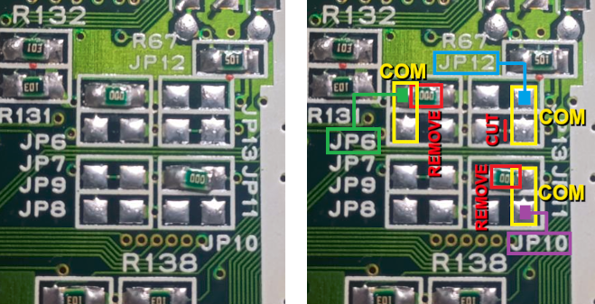
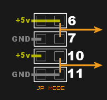
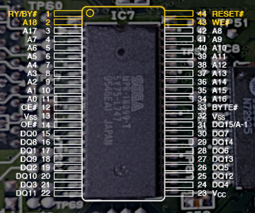
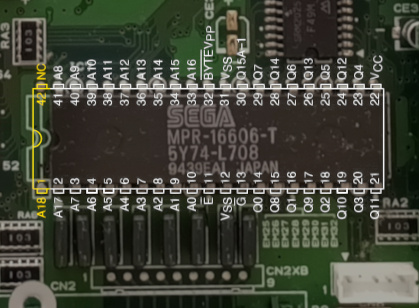
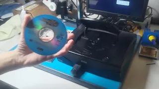
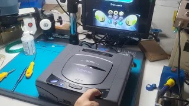

<a name="top"></a>

# Saturn Smart Reset Button

[](LICENSE)
[](https://github.com/Electroanalog/SAT-SRB/releases)
[](https://github.com/Electroanalog/SAT-SRB/releases)
[](https://youtu.be/afSKgW2aVuQ) 
&nbsp;&nbsp;&nbsp;
<span>
[](https://github.com/Electroanalog/SAT-SRB)[](https://github.com/Electroanalog/SAT-SRB)[](https://github.com/Electroanalog/SAT-SRB)
</span>

**O SAT-SRB é um mod que dispensa o uso de chaves e seletores mecânicos para seleção de região do Sega Saturn, habilita múltiplos bancos de BIOS e utiliza LED RGB.
Baseado originalmente no projeto [**Saturn Switchless Mod**](https://github.com/sebknzl/saturnmod) (2004), essa versão introduz suporte completo à troca de bancos BIOS através de ICs reprogramáveis e melhora o feedback visual através de LED RGB, com código totalmente reescrito para o compilador XC8.**

## Índice

- [Guia rápido](#guia-rápido)
- [Preparando o PIC](#preparando-o-pic)
- [Notas de Instalação](#notas-de-instalação)
- [Considerações sobre a Placa Principal do Saturn](#considerações-sobre-a-placa-principal-do-saturn)
- [Mapeamento de bancos da BIOS](#mapeamento-de-bancos-de-bios)
- [Preparo dos binários de BIOS](#preparo-dos-binários-de-bios-byte-swap-e-junção)
- [Gravação da BIOS](#gravação-da-bios-no-ci-gravadores-e-adaptadores)
- [Instalação da BIOS](#instalação-física-da-bios)
- [Vídeos de Demonstração](#vídeos-de-demonstração)
- [Solução de Problemas & Diagnóstico](#solução-de-problemas--diagnóstico)
- [FAQ](#-faq---perguntas-frequentes)
- [Sobre este Guia](#sobre-este-guia)

---

## Visão Geral

### Funcionalidades

- ✅ Seleção de região sem chaves mecânicas (Japan/North America/Europe) 
- ✅ Controle via botão RESET (Toque curto/médio/longo)  
- ✅ Suporta upgrade para dual/multi-BIOS com chip reprogramável  
- ✅ Gerencia até 4 bancos de BIOS (Endereçamento via PIC)  
- ✅ LED RGB para feedback visual (cátodo comum)  
- ✅ Cores do LED e capacidade de BIOS totalmente configuráveis via macros `#define`  
- ✅ Seleção de frequência vertical 50Hz / 60Hz  
- ✅ Salvamento automático em EEPROM do último banco/região utilizado  
- ✅ Compatível com todas as placas do Sega Saturn  

### Suporte ao LED RGB

<details>
<summary> 🔴🟢🔵 Atribuição de cores do LED para regiões/BIOS - Clique para expandir</summary>

```c
// ** LED COLOR ASSIGNMENT **
#define COLOR_JAP   LED_BLUE
#define COLOR_USA   LED_GREEN
#define COLOR_JAP2  LED_CYAN
#define COLOR_EUR   LED_YELLOW
#define COLOR_JAP3  LED_PURPLE
```
</details>

### Suporte à bankswitch para upgrade multi-BIOS

Este mod é compatível com os seguintes circuitos integrados regraváveis para substituição de BIOS com múltiplos bancos:

- 29F800 (SOP44, 8Mbit, 2 bancos)  
- 29F1610 (SOP44, 16Mbit, 4 bancos)  
- 27C800 (DIP42, 8Mbit, 2 bancos)  
- 27C160 (DIP42, 16Mbit, 4 bancos)  

<details>
<summary>  ℹ️ O tamanho do chip BIOS é definido por macro e pode ser alterado - Clique para expandir</summary>

```c
// ** SELECT BIOS IC **
#define BIOS    IC_8M   // IC_16M (4 banks) | IC_8M (2 banks)
```
</details>

> [!NOTE]  
> O recurso de bankswitch é opcional.  
> Se estiver utilizando a BIOS original da placa ou substituindo por uma BIOS Region-Free, defina `IC_8M`.  
> Nesse caso, as conexões de bankswitch do PIC não precisam ser conectadas.

### Uso do Botão

| Ação                    | Função                                                         |
|-------------------------|----------------------------------------------------------------|
| Toque curto (<250ms)    | RESET do console                                               |
| Toque médio (<1250ms)   | Troca de frequências 50Hz / 60Hz                               |
| Toque longo (>1250ms)   | Ciclo entre seleção de região/BIOS                             |

> [!TIP]  
> O LED pisca para indicar a 50Hz (lento) ou 60Hz (rápido)

---

## Guia Rápido

> [!IMPORTANT]  
> Esta seção resume os passos essenciais para instalação. Para orientações completas, consulte as seções detalhadas abaixo.

### Materiais necessários para instalação básica

- ✅ PIC16F630 ou PIC16F676 com `.hex` pré-gravado  
- ✅ LED RGB (cátodo comum) + resistores: 🔴 220 Ω 🟢 2k Ω 🔵 1.2k Ω  
- ✅ Ferramentas para soldagem: ferro de ponta fina, estanho, multímetro  
- ✅ Fio wire-wrap 30 AWG  
- ✅ Estilete ou lâmina tipo bisturi para corte de trilhas na placa  

### Materiais adicionais para bankswitch

- ✅ CI reprogramável e com os bancos de BIOS gravados corretamente 
- ✅ Estação de retrabalho para BIOS SOP40 ou estação dessoldadora / sugador de solda para BIOS DIP40  

### ⚠️ Pré-requisitos e Responsabilidade

Esta modificação requer:

- ✅ Conhecimento básico sobre microcontroladores e sistemas embarcados  
- ✅ Familiaridade com eletrônica e manuseio seguro de componentes  
- ✅ Habilidade em soldagem, incluindo solda de precisão
- 💡 **Opcional, mas recomendado:** microscópio para inspeção de soldas, especialmente útil em CIs no encapsulamento SOP  

Caso você não atenda a esses requisitos, é altamente recomendável procurar a ajuda de um técnico qualificado ou profissional da área de eletrônica.

> **Aviso:** A Electroanalog não se responsabiliza por quaisquer danos ao seu console, componentes ou equipamentos decorrentes de instalação incorreta ou do não cumprimento das instruções e alertas fornecidos neste guia.

---

### Resumo de etapas

| Etapa | Descrição                                                                   | Aplicável a              |
|-------|-----------------------------------------------------------------------------|--------------------------|
| 1️⃣    | Cortar trilhas fixas de região, frequência e sinal de reset                 | Básico & Bankswitch      |
| 2️⃣    | Conectar ao PIC: alimentação, controle do LED, reset, região e frequência   | Básico & Bankswitch      |
| 3️⃣    | Ligar o sistema e verificar boot, LED, reset, troca de regiao/BIOS e troca de modo de vídeo | Básico & Bankswitch      |
| 4️⃣    | Preparar a BIOS: byte-swap → concatenar (`copy /b`) → gravar em EEPROM      | Bankswitch apenas        |
| 5️⃣    | Remover IC7 original com estação de retrabalho (SOP) ou dessoldadora (DIP) e instale o novo chip | Bankswitch apenas        |
| 6️⃣    | Conectar o PIC às linhas A18 e/ou A19                                       | Bankswitch apenas        |

> [!NOTE]  
> Prévia do esquema elétrico - Clique para aumentar  
> <a href="../img/Schematic_SAT-SRB.png">
>   
> </a><br>
> Consulte [Notas de Instalação](#notas-de-instalação) para mais detalhes de conexão dos fios.

---

### ✅ Checklist Pré-Instalação

- [ ] Se estiver utilizando sinais de região e frequência (VF), certifique-se de que os DIP switches foram corretamente preparados (veja detalhes nas seções seguintes)  
- [ ] Se a BIOS foi substituída, verifique o alinhamento e soldagem correta do chip  
- [ ] Fios de controle conectados e conferidos  
- [ ] PIC está ligado com o LED aceso  
- [ ] O console exibe a logo do Sega Saturn ao ligar  
- [ ] Botão RESET alterna entre BIOS e modos 50Hz/60Hz corretamente  
- [ ] Cores do LED mudam conforme os perfis de região  
- [ ] Console inicializa com sucesso em cada região/BIOS  

> [!TIP]  
> As próximas seções como [Notas de Instalação](#notas-de-instalação), [Instalação da BIOS](#instalação-física-da-bios) e [Solução de Problemas & Diagnóstico](#solução-de-problemas--diagnóstico) orientam cada etapa de fiação com diagramas e verificações para evitar erros comuns.

[🔝 Voltar ao topo](#top)

---

## Preparando o PIC

### Compilação do código-fonte (opcional)

Caso deseje compilar o firmware manualmente a partir do código-fonte:

- Use o [MPLAB X IDE](https://www.microchip.com/en-us/tools-resources/develop/mplab-x-ide) com o compilador [XC8 Compiler](https://www.microchip.com/en-us/tools-resources/develop/mplab-xc-compilers)  
- Microcontrolador alvo: **PIC16F630** ou **PIC16F676**  
- Frequência de clock: `4MHz` interno  
- `MCLR` desabilitado (configurado como entrada)  

### ⚡ `.hex` pré-compilado

Para maior praticidade, o arquivo **`.hex`** já compilado está disponível na seção [Releases](https://github.com/Electroanalog/SAT-SRB/releases) do repositório.
Com ele, é possível gravar rapidamente o firmware usando:

- **MPLAB IPE 6.20 ou superior**
- **PICKit 3** ou programador compatível

Nenhuma compilação manual do código é necessária ao utilizar o arquivo `.hex`.

[🔝 Voltar ao topo](#top)

---

## Notas de Instalação

- Projetado para funcionar com todas as placas do Sega Saturn:  
  - VA0, VA1, VA SD, VA SG, VA9, VA13  
- Controle dos DIP switches via RC0–RC2 (JP6, JP10, JP12) → **Válido apenas quando se utiliza BIOS padrão**  
- O LED RGB usado neste projeto é do tipo **alto-brilho** (cátodo comum).  
  - Valores recomendados de resistores:  
    🔴 Vermelho = **220 Ω**, 🟢 Verde = **2k Ω**, 🔵 Azul = **1.2k Ω**  

> [!TIP]  
> Se utilizar LEDs difusos ou opacos, os valores dos resistores podem ser reduzidos para alcançar o brilho desejado.

---

### Pinagem do PIC16F630 / PIC16F676

| Pino | Nome | Função                               |
|------|------|--------------------------------------|
| 1    | VCC  | Alimentação +5 V                     |
| 2    | RA5  | A18 para bankswitch de BIOS          |
| 3    | RA4  | A19 para bankswitch  de BIOS (apenas 16Mbit) |
| 4    | RA3  | ICSP MCLR / VPP                      |
| 5    | RC5  | LED Vermelho (ânodo)                 |
| 6    | RC4  | LED Verde (ânodo)                    |
| 7    | RC3  | LED Azul (ânodo)                     |
| 8    | RC2  | JP12 dipswitch de região             |
| 9    | RC1  | JP10 dipswitch de região             |
| 10   | RC0  | JP6 dipswitch de região              |
| 11   | RA2  | RESET para o console           |
| 12   | RA1  | Controle de frequência 50/60Hz / ICSP CLK |
| 13   | RA0  | Botão RESET / ICSP DAT    |
| 14   | VSS  | Terra (GND)                          |

> [!TIP]  
> O esquema completo pode ser consultado na seção [Guia Rápido](#guia-rápido) para apoio na instalação.

---

### Referência de Layout dos DIP Switches

#### Mapeamento de Região

| Região             | JP6  | JP10 | JP12 |
|--------------------|------|------|------|
| Japan (JP)         | 1    | 0    | 0    |
| North America (NA) | 0    | 1    | 0    |
| Europe (EU)        | 0    | 1    | 1    |

> [!IMPORTANT]  
> Consoles com **BIOS Region-Free** não exigem controle dos sinais dos DIP switches, que podem permanecer no estado original.  
> Para a **BIOS original** ou dumps padrão, o PIC deve controlar os sinais JP6, JP10 e JP12, e essas linhas devem estar corretamente conectadas.

A imagem abaixo ilustra o layout típico dos pares de DIP switches de região nas placas do Sega Saturn configuradas originalmente para a região Japan, junto com os pontos de modificação importantes:



- **Marcação amarela** indica os **terminais comuns** dos pares usados pelo sistema para detecção de região.  
- **Marcação vermelha** indica **resistores de 0 Ω** ou **trilhas fixas** que devem ser **removidas ou cortadas** para permitir o uso seguro dos sinais com o microcontrolador PIC.  
- **Linha verde** representa o sinal conectado ao **JP6**  
- **Linha roxa** representa o sinal conectado ao **JP10**  
- **Linha azul** representa o sinal conectado ao **JP12**

### Conexão dos Sinais de Região via IC9 (315-5744)

Todas as revisões de placa do Sega Saturn incluem um CI identificado como **315-5744** (IC9), que faz a interface com os DIP switches de região (JP6, JP10, JP12).  
Esse CI está localizado no **lado superior** da placa e oferece pontos de acesso convenientes para conectar os sinais de região ao PIC, especialmente útil quando alguns DIP switches estão no **lado inferior**, dependendo da revisão da placa.

A imagem abaixo mostra os pinos relevantes do IC9 utilizados para acessar os sinais de região:


- **Pino 5** (verde): Linha de região conectada ao **JP6**  
- **Pino 7** (roxo): Linha de região conectada ao **JP10**  
- **Pino 8** (azul): Linha de região conectada ao **JP12**

Exemplos de uso:

- Em placas **VA-SG**, todos os DIP switches de região estão no lado inferior, tornando o IC9 o ponto de conexão preferencial para todos os sinais.  
- Em placas **VA-SD**, apenas o **JP6** está no lado inferior e nesse caso, o **pino 5 do IC9** pode ser usado para o sinal **RC0**, enquanto **JP10** e **JP12** permanecem acessíveis pelo lado superior para **RC1** e **RC2**, respectivamente.

> [!WARNING]  
> A conexão ao IC9 afeta apenas a passagem dos fios dos sinais.  
> As trilhas dos DIP switches ainda devem ser preparadas corretamente. Qualquer ligação fixa a VCC ou GND deve ser removida conforme descrito anteriormente.

### Fiação na Placa Frontal dos Controles (Botão & LED)

Algumas conexões devem ser feitas na **placa frontal dos controles**, onde estão localizados o botão RESET e o LED verde original de alimentação.  
A imagem de referência abaixo mostra os dois lados da placa, um corte de trilha e os pontos de solda:


- **Substituição do LED:**  
  Remova o LED verde original e utilize a **via (K)** para conectar o cátodo comum do seu **LED RGB** (geralmente o terminal maior).  
  Certifique-se de que a **via (A)** original na placa esteja **isolada eletricamente**, para que não entre em contato com nenhum terminal do novo LED RGB.

- **Botão RESET/Ciclo:**  
  No **lado traseiro** da placa, corte a trilha marcada em vermelho (ver foto).  
  No **lado frontal**, solde o fio vindo do **pino 13 (RA0)** do PIC ao terminal identificado como **RA0** (conforme mostrado na imagem). Isso permite que a função RESET/Ciclo seja controlada pelo mod.

- **Sinal RESET do console:**  
  Solde o fio vindo do **pino 11 (RA2)** do PIC ao **11º pino do conector CN8**, na posição indicada como **RA2** na imagem.  
  (Visto de cima, esse é o **sexto pino da direita para a esquerda**.)

Garanta que os cortes de trilha e a passagem dos fios sigam exatamente a imagem de referência para evitar conflitos elétricos ou falhas de sinal.

[🔝 Voltar ao topo](#top)

---

## Considerações sobre a Placa Principal do Saturn

Todas as revisões de placa do Sega Saturn incluem **trilhas fixas** que conectam os pares de DIP switches diretamente ao **GND** ou ao **VCC**.  
A localização exata dessas conexões pode variar conforme a **revisão da placa** e a **região do console**, sendo normalmente implementadas por **trilhas diretas na PCB** ou por **resistores de 0 Ω**.

Essas ligações fixas podem estar em **qualquer lado** de um par de DIP switches e devem ser cuidadosamente **identificadas e removidas** antes de conectar o sinal correspondente ao **PIC**.

Por exemplo:
- Um caso comum é o **JP13** estar permanentemente ligado ao GND quando o **JP12** não é utilizado  
- Em algumas placas, o **R29** substitui o **JP2** como lado GND do par de seleção de frequência  

Cada DIP switch possui um terminal correspondente emparelhado:

- **JP6 ↔ JP7**  
- **JP10 ↔ JP11**  
- **JP12 ↔ JP13**  
- **JP1 ↔ JP2** (ou **R29**, dependendo da revisão da placa)

> [!NOTE]  
> JP8–JP9 também formam um par físico, mas **não participam da seleção de região** e **não precisam ser modificados**.

Esses pares são conectados da seguinte forma:
- Um lado (ex: JP6, JP10, JP12, JP1) normalmente vai para o **VCC**  
- O lado emparelhado (ex: JP7, JP11, JP13, JP2/R29) vai para o **GND**

Essas conexões são feitas em pares correspondentes e devem ser cuidadosamente verificadas em cada revisão de placa antes do uso.

> [!CAUTION]  
> Apenas um terminal de cada par deve estar ativo.

Por exemplo, se o **JP6** estiver conectado ao VCC, então o **JP7** (seu par) deve permanecer **desconectado**.  
Essa regra se aplica a todos os pares de DIP switches: **os dois lados nunca devem estar ativos ao mesmo tempo**.



### ⚠️ Aviso Importante

Antes de conectar qualquer sinal de DIP switch ao PIC:

> [!WARNING]  
> O terminal comum de cada par de DIP switches deve estar completamente desconectado de qualquer fonte fixa de VCC ou GND.  
> Isso garante que o PIC possa controlar a linha em nível ALTO ou BAIXO com segurança.  
> Se o PIC tentar controlar um sinal enquanto o outro lado estiver fixado, ocorrerá um **conflito grave de sinal** entre níveis lógicos.

- ✅ Remova qualquer **resistor de 0 Ω** ou **trilha** que force um nível lógico fixo.  
- ✅ Certifique-se de que **ambos os lados de cada par de DIP switches** **não estejam fisicamente conectados** ao **VCC ou GND**.  
- ✅ Confirme com um **multímetro** que o terminal comum está eletricamente isolado da alimentação e do terra.

> [!CAUTION]  
> Não isolar corretamente as linhas de sinal dos DIP switches pode causar **danos permanentes** à placa principal do Sega Saturn e/ou ao MCU PIC.  
> Sempre verifique o estado elétrico de cada par de DIP switches antes de ativar o controle de região ou frequência via PIC.

[🔝 Voltar ao topo](#top)

---

## Mapeamento de Bancos de BIOS

Para suportar múltiplas variantes de BIOS, o sistema permite mapear imagens específicas para cada banco:

### Mapeamento para 8Mbit (2 bancos de 512KB)

| Região | Banco | A18 | 
|--------|-------|-----| 
| JP     | 0     | LO  | 
| NA     | 1 🔁  | HI  | 
| EU     | 1 🔁  | HI  | 

### Mapeamento para 16Mbit (4 bancos de 512KB)

| Região   | Banco | A19 | A18 | 
|----------|--------|------|------| 
| JP(1)    | 0      | LO   | LO   | 
| NA       | 1 🔁   | LO   | HI   |
| JP(2)    | 2      | HI   | LO   | 
| EU       | 1 🔁   | LO   | HI   | 
| JP(3)    | 3      | HI   | HI   | 

> 🔁 Banco compartilhado entre NA / EU

### Exemplos de BIOS suportadas:

Essas imagens de BIOS possuem 512KB cada e são adequadas para uso em chips de 8Mbit ou 16Mbit divididos em bancos de 512KB (4Mbit):

- **JP(1):** Sega Saturn (Sega)  
- **JP(2):** V-Saturn (Victor)  
- **JP(3):** Hi-Saturn (Hitachi)  
- **NA/EU:** Sega Saturn - World-Wide (Sega)  

> [!IMPORTANT]  
> O mod funciona com a **BIOS original do console** (IC7), um dump padrão de BIOS ou uma **BIOS Region-Free**.  
> Ao utilizar a BIOS original ou um dump padrão, o PIC deve controlar as linhas de região (JP6, JP10, JP12), que devem estar corretamente roteadas para os pads correspondentes na placa principal.

> [!TIP]  
> **Somente versões de BIOS Region-Free dispensam a seleção de região.**

[🔝 Voltar ao topo](#top)

---

## Preparo dos binários de BIOS (byte-swap e junção)

1. **Endianness:**  
   Os arquivos binários de BIOS devem estar no formato **big-endian** (com bytes invertidos em pares).  
   Isso é necessário para compatibilidade com a arquitetura baseada no 68000 do Sega Saturn.

> ℹ️ A maioria dos dumps de BIOS encontrados online está em formato little-endian e precisam passar por byte-swap antes da mesclagem.

Você pode verificar a ordem dos bytes da BIOS usando um editor hexadecimal como o [HxD](https://mh-nexus.de/en/hxd/), ou via softwares de programadores como o **XGPro (XGecu Pro)** com o gravador **T48 (TL866-3G)**, que oferece a opção de **byte-swap**.

<details>
<summary>Exemplo de dump de BIOS: little-endian vs big-endian - Clique para expandir</summary>

### Example: BIOS header region (addresses 0x9C0–0x9FF)

**Visualização little-endian (dump bruto):**

    000009C0  43 4F 50 59 52 49 47 48 54 28 43 29 20 53 45 47  COPYRIGHT(C) SEG
    000009D0  41 20 45 4E 54 45 52 50 52 49 53 45 53 2C 4C 54  A ENTERPRISES,LT
    000009E0  44 2E 20 31 39 39 34 20 41 4C 4C 20 52 49 47 48  D. 1994 ALL RIGH
    000009F0  54 53 20 52 45 53 45 52 56 45 44 20 20 20 20 20  TS RESERVED     

**Visualização big-endian (com byte-swap, correto para sistemas 68000):**

    000009C0  4F 43 59 50 49 52 48 47 28 54 29 43 53 20 47 45  OCYPIRHG(T)CS GE
    000009D0  20 41 4E 45 45 54 50 52 49 52 45 53 2C 53 54 4C   ANEETPRIRE,S STL
    000009E0  2E 44 31 20 39 39 20 34 4C 41 20 4C 49 52 48 47  .D1 99 4LA LIRHG
    000009F0  53 54 52 20 53 45 52 45 45 56 44 20 20 20 20 20  STR SEREEV D      

</details>

> [!NOTE]  
> Utilize ferramentas ou scripts que façam a inversão de bytes em **pares (16 bits)** para converter de little-endian para big-endian.

> [!TIP]  
> Um utilitário de linha de comando útil incluído neste repositório é [`SwapEndian.exe`](https://raw.githubusercontent.com/Electroanalog/SAT-SRB/main/util/SwapEndian.zip).  
> Uso: `SwapEndian <arquivo>`

2. **Junção dos binários de BIOS:**  
   Concatene os arquivos de BIOS na ordem correspondente aos bancos de memória:

   **Para CI de 8Mbit (2 bancos, 1024KB):**  
   ```cmd
   copy /b JAP.BIN + USA.BIN 29F800.BIN
   ```

   **Para CI de 16Mbit (4 bancos, 2048KB):**  
   ```cmd
   copy /b JAP.BIN + USA.BIN + JAP2.BIN + JAP3.BIN 29F1610.BIN
   ```

<details>
<summary>ℹ️ Mapeamento de endereços da BIOS dentro do binário final - Clique para expandir</summary>
<br>

> | Banco | Faixa de Endereço       | Tamanho  | Capacidade do Chip | CIs Compatíveis                      |
> |--------|--------------------------|----------|---------------------|--------------------------------------|
> | 0      | 0x000000 – 0x07FFFF      | 512 KB   | 8Mbit / 16Mbit      | 29F800, 27C800 / 29F1610, 27C160     |
> | 1      | 0x080000 – 0x0FFFFF      | 512 KB   | 8Mbit / 16Mbit      | 29F800, 27C800 / 29F1610, 27C160     |
> | 2      | 0x100000 – 0x17FFFF      | 512 KB   | 16Mbit              | 29F1610, 27C160                      |
> | 3      | 0x180000 – 0x1FFFFF      | 512 KB   | 16Mbit              | 29F1610, 27C160                      |

</details>
<br>

[🔝 Voltar ao topo](#top)

---

## Gravação da BIOS no CI (Gravadores e Adaptadores)

> [!IMPORTANT]  
> Certifique-se de que o binário resultante (ex: `29F800.BIN`) esteja em formato **byte-swap** antes da gravação.

3. **Gravação:**  
   Utilize um gravador **T48 (TL866-3G)** com os seguintes adaptadores:

   - **ADP_S44-EX-1** para chips SOP44: 29F800 e 29F1610  
   - **ADP_D42-EX-A** para chips DIP42: 27C800 e 27C160  

   

   Também é possível utilizar qualquer outro gravador compatível com esses CIs e seus respectivos encapsulamentos.

---

## Instalação Física da BIOS

> [!WARNING]  
> Os chips flash utilizados neste mod (**29F800** e **29F1610**) possuem encapsulamento **SOP44**, enquanto a ROM original do Sega Saturn (IC7) é do tipo **SOP40**.  
> Portanto, ao instalar o chip flash na placa, o alinhamento correto e o manuseio dos pinos são etapas **críticas**.

### Alinhamento do CI de BIOS (SOP44) no local do IC7

- Alinhe o pino **3** (A17) e o pino **42** (A8) do chip flash com o local dos terminais **1** (A17) e **40** (A8) da ROM original SOP40 (IC7).
- Isso faz com que os pinos **1–2** e **43–44** do chip flash fiquem **fora da área de solda** da ROM original e estes devem ser mantidos **levantados** (sem contato com a placa).
- A ROM original SOP40 deve ser **dessoldada com a estação de retrabalho**. Essa ferramenta é **essencial** para remoção segura sem danificar a placa.



### Conexões para os pinos levantados:

#### Para **29F800**:
- Pino **1** (RY/BY#): **Não conectado** ou ligado ao **GND (VSS)**
- Pino **2** (A18): Conectar ao **RA5 (Pino 2)** do PIC
- Pino **43** (WE#): Conectar ao **VCC (+5V)**
- Pino **44** (RESET#): Conectar ao **VCC (+5V)**

#### Para **29F1610**:
- Pino **1** (WE#): Conectar ao **VCC (+5V)**
- Pino **2** (A18): Conectar ao **RA5 (Pino 2)** do PIC
- Pino **43** (A19): Conectar ao **RA4 (Pino 3)** do PIC
- Pino **44** (WP#): Conectar ao **GND (VSS)**

---

> [!WARNING]  
> Na revisão VA0 do Sega Saturn, a ROM original (IC7) é do tipo **DIP40**.  
> Nesse caso, a BIOS de substituição deve utilizar um encapsulamento **DIP42** compatível, como os EPROMs UV **27C800** (8Mbit) ou **27C160** (16Mbit).  
> O alinhamento e o manuseio correto dos pinos continuam sendo **críticos**.

### Alinhamento do CI de BIOS (DIP42) no local do IC7

- Alinhe o pino **2** (A17) e o pino **41** (A8) da EPROM com as vias **1** (A17) e **40** (A8) da ROM original DIP40 (IC7).
- Embora a placa possua vias para DIP42, elas têm funções diferentes e os pinos **1** e **42** da EPROM devem ser **levantados**.
- A ROM original DIP40 deve ser **removida com estação dessoldadora** (tipo sugador). Essa ferramenta é **altamente recomendada** para evitar danos às vias e trilhas da placa.
- Também é bem-vindo instalar um **soquete DIP40** após a remoção, o que facilita testes e substituições futuras.



### Conexões para os pinos levantados:

#### Para **27C800**:
- Pino **1** (A18): Conectar ao **RA5 (Pino 2)** do PIC  
- Pino **42** (NC): **Não conectado**

#### Para **27C160**:
- Pino **1** (A18): Conectar ao **RA5 (Pino 2)** do PIC  
- Pino **42** (A19): Conectar ao **RA4 (Pino 3)** do PIC

[🔝 Voltar ao topo](#top)

---

## Vídeos de Demonstração

Exemplos do mod em funcionamento, exibindo o comportamento esperado após uma instalação correta.

▶ Sega Saturn com mod SRB e BIOS de banco duplo:  
[](https://youtu.be/afSKgW2aVuQ)  

▶ V-Saturn com mod SRB e BIOS multi-banco:  
[](https://youtu.be/ilHhgGw1XoA)  

[🔝 Voltar ao topo](#top)

---

## Solução de Problemas & Diagnóstico

| Problema                                 | Detalhes                                                                                                                                                   |
|------------------------------------------|------------------------------------------------------------------------------------------------------------------------------------------------------------|
| **Mod não funciona após a instalação**   | **Possíveis causas:**<br>- Ausência de alimentação no PIC (verifique VCC e GND nos pinos 1 e 14).<br>- Firmware não compilado corretamente ou gravado no MCU incorreto. |
| **Botão RESET não altera região ou frequência** | **Verifique:**<br>- Tempo de pressionamento:<br>  • Curto (<250 ms): RESET<br>  • Médio (<1250 ms): Alterna frequência<br>  • Longo (>1250 ms): Alterna região/BIOS<br>- Conexões corretas das linhas de RESET:<br>  • **RA0** ↔ entrada do botão<br>  • **RA2** ↔ saída de RESET para o console |
| **LED RGB não acende ou mostra cores incorretas** | **Causas comuns:**<br>- Valores de resistores não otimizados para o brilho do LED:<br> 🔴 Vermelho = 220 Ω; 🟢 Verde = 2 kΩ; 🔵 Azul = 1.2 kΩ  *(para LEDs de alto brilho)*<br>- Para **LEDs difusos ou de baixo brilho**, use **resistores menores** para melhorar a visibilidade.<br>- Tipo de LED incorreto: deve ser **cátodo comum**. |
| **Imagem em preto e branco ou esticada** | **Verifique:**<br>- Pressionamento médio (<1250 ms) do botão RESET alterna entre os modos de vídeo 50Hz e 60Hz.<br>- Confirme que **RA1** (saída de alternância de frequência) está conectada ao **terminal comum de JP1**.<br>- Certifique-se de que o par JP1–JP2 (ou R29) foi preparado corretamente. Ambos os lados devem estar desconectados de VCC ou GND fixos para permitir o controle pelo PIC. |
| **Console não inicia ou exibe tela preta** | **Possíveis causas:**<br>- BIOS não convertida para **big-endian** antes da mesclagem/gravação.<br>- Chip flash desalinhado: verifique a adaptação correta dos pinos, especialmente os levantados (A18/A19, WE#, RESET#).<br>- Soldagem ruim: verifique se todos os pinos do chip estão bem soldados e sem curtos entre pads adjacentes.<br>- Linhas **A18** e **A19** não conectadas corretamente do PIC aos pinos correspondentes da BIOS. |
| **Animação da BIOS nunca muda ao alternar** | **Verifique:**<br>- Se apenas um banco de BIOS foi gravado (outros bancos em branco ou com a mesma imagem).<br>- Se as linhas **A18** e **A19** estão fixadas em VCC ou GND. Elas devem permanecer sob controle do PIC. |

[🔝 Voltar ao topo](#top)

---

## ❔ FAQ - Perguntas Frequentes

<details>
<summary>É necessário fazer byte-swap nos arquivos de BIOS?</summary>

*Sim. Todas as imagens de BIOS devem ser convertidas para o formato **big-endian** antes da mesclagem ou gravação.  
A maioria dos dumps padrão encontrados online está em **little-endian** e precisam ser convertidos para garantir compatibilidade com a arquitetura 68000 do Saturn.*
</details>

<details>
<summary>Posso usar apenas um binário de BIOS Region-Free?</summary>

*Sim. Binários de BIOS Region-Free funcionam sem a necessidade do controle dos jumpers **JP6**, **JP10** e **JP12** pelo PIC.  
Se **todos os bancos de BIOS** contiverem versões Region-Free, essas linhas podem ser **deixadas desconectadas**. A seleção de região por pressionamento longo do botão não terá efeito, mas a troca de BIOS funcionará normalmente.*
</details>

<details>
<summary>Preciso usar todos os bancos de BIOS?</summary>

*Não. O mod suporta diferentes modos de uso:*

- ****BIOS original (sem troca):***  
  Defina `#define BIOS IC_8M` e deixe **A18** e **A19** desconectados.  
  Nesse modo, o mod alterna entre 3 regiões (JP → NA → EU ↺) com pressionamentos longos no botão RESET.  
  Para isso funcionar, as linhas de seleção de região (JP6, JP10, JP12) devem estar corretamente conectadas ao PIC. Se não estiverem, a troca de regiões não terá efeito.*

- ****Modo de 2 bancos (flash de 8Mbit):***  
  Defina `IC_8M` e conecte **A18**.  
  O PIC alternará entre 2 bancos de BIOS com suporte às 3 regiões.*

- ****Modo de 4 bancos (flash de 16Mbit):***  
  Defina `IC_16M` e conecte **A18** e **A19**.  
  Isso permite alternar entre 5 perfis (JP → NA → JAP2 → EU → JAP3 ↺) com suporte completo a múltiplas BIOS.  
  Os ciclos adicionais são úteis para o uso de BIOS japonesas como V-Saturn e Hi-Saturn.  
  Use `IC_16M` apenas se todos os 4 bancos estiverem preenchidos corretamente. Caso contrário, use `IC_8M` para evitar ciclos em posições vazias.*
</details>

<details>
<summary>Os dipswitches de região fazem algum efeito sobre uma BIOS Region-Free?</summary>

*Não. Imagens de BIOS Region-Free ignoram as linhas de região (JP6, JP10, JP12) e sempre permitem que o console inicie **qualquer disco**, independentemente da região.  
Você ainda pode instalar múltiplas BIOS Region-Free (ex: Sega, V-Saturn, Hi-Saturn) e alternar entre elas com pressionamentos longos no botão RESET, mesmo que as linhas de região não estejam conectadas.*
</details>

<details>
<summary>O que acontece se eu não remover os jumpers de região/frequência de fábrica?</summary>

*Se os dipswitches (ex: JP6, JP10, JP12, JP1–JP2/R29) estiverem com seus terminais comuns conectados à **VCC ou GND fixos**, conectá-los ao PIC pode causar um **conflito elétrico** quando o PIC tentar controlar esses sinais.*  
Isso pode gerar erros lógicos ou até **danos permanentes** ao PIC e/ou à placa do Saturn.

*No entanto, **se você não for conectar o PIC a essas linhas**, por exemplo:*
- *Está usando apenas BIOS Region-Free (sem controle de região), e/ou*  
- *Não vai usar a alternância de 50/60Hz (sem controle de frequência)*

*Então os dipswitches originais podem permanecer da forma que vem de fábrica, sem qualquer risco.  
Sempre revise seu plano de fiação antes de modificar os pads dos dipswitches.*
</details>

<details>
<summary>É necessário sempre configurar JP1–JP2/R29 para alternar frequência?</summary>

*Apenas se você quiser usar a função de **alternância entre 50Hz / 60Hz** com pressionamento médio do botão.  
Para uma comutação precisa e vídeo estável, recomenda-se a instalação de um **DFO (Dual Frequency Oscillator)** (não abordado neste guia).  
Se essa função não for necessária, o console continuará operando com sua **frequência padrão fixa**, e **nenhuma modificação em JP1, JP2/R29 será necessária**. Nesse caso, a linha **VF (RA1)** também pode ser deixada desconectada, e o pressionamento médio não terá qualquer efeito.*
</details>

<details>
<summary>Posso usar outro tipo de LED RGB?</summary>

*Não. Este mod é compatível apenas com **LEDs RGB de cátodo comum**.  
LEDs endereçáveis (como WS2812) ou de ânodo comum não são compatíveis sem alterações no código e no circuito.*
</details>
<br>

[🔝 Voltar ao topo](#top)

---

### Sobre este Guia

Esta documentação foi elaborada por *Electroanalog* com forte foco em clareza, confiabilidade e facilidade de aplicação.  
Seja para quem está instalando o mod pela primeira vez ou personalizando os recursos avançados como o uso de bancos de BIOS, o objetivo deste guia é oferecer informação técnica consistente do início ao fim.

Todas as seções priorizam:

- Instruções passo-a-passo para uso no hardware real  
- Tabelas objetivas, imagens ilustrativas e fluxo lógico  
- Explicações transparentes sobre as decisões de projeto  
- Seções expansíveis para facilitar a visualização.

Este não é um guia oficial nem uma especificação formal. É um esforço da comunidade para elevar o nível de qualidade da documentação em projetos open-source de hardware.  
A documentação deste projeto está em constante evolução. Sugestões e melhorias são sempre bem-vindas.

---

## Licença

Este é um trabalho derivado licenciado sob a [GNU General Public License v2 ou posterior](https://www.gnu.org/licenses/old-licenses/gpl-2.0.html)

---

## Créditos

Versão aprimorada, porte para XC8 e lógica de LED RGB / bankswitch por **Electroanalog® VICE (2025)**  
Baseado em [*Saturn Switchless Mod*](https://github.com/sebknzl/saturnmod) de **Sebastian Kienzl (2004)**  

*Sega Saturn é uma marca registrada da SEGA Corporation. Todos os direitos reservados.*

---

## Tópicos / Tags

`sega-saturn` `saturn` `reset-mod` `pic16f630` `pic16f676` `modchip` `led-feedback` `multi-bios` `sega-hardware` `diy-console-mod` `retro-gaming`
